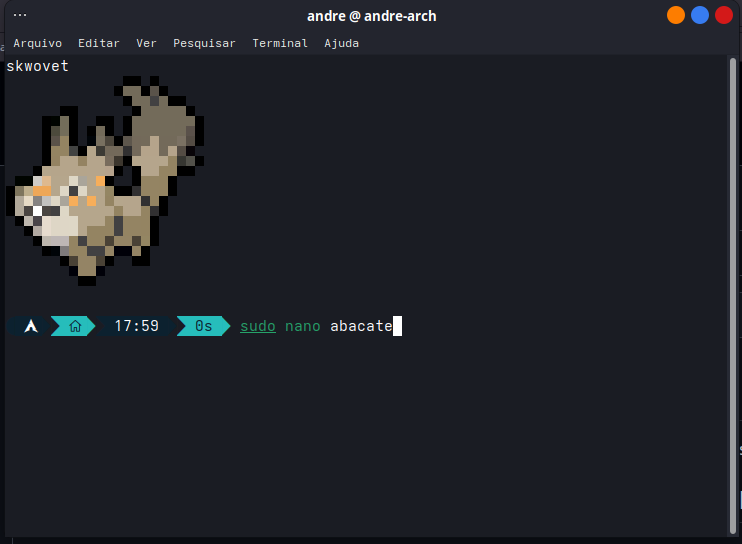

# Arch-Config
minha configuração arch, para backups caso o sistema cometa suicídio

## Personalização do terminal

Você pode ver os passos da minha configuração em [terminal.md](https://github.com/AndreKaled/Arch-Config/blob/main/terminal.md)

## Instalação de apps/recursos

Para instalar rapidamente alguns apps sem ficar procurando de site em site, pode seguir vendo meu script de instalação de apps em [apps.md](https://github.com/AndreKaled/Arch-Config/blob/main/apps.md), ele também instala algumas ferramentas e linguagens de programação

## Wallpapers e icones de login

Baixar wallpaper e icone usados para login e background da área de trabalho.
[em breve]